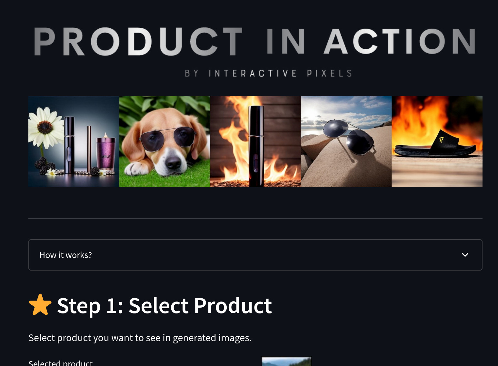

# Product in Action - Running Finetuned Stable Diffusion on VAST

This is my simple web for generating images of real products using finetuned stable diffusion.  

You can try it here: [https://action.streamlit.app/](https://action.streamlit.app/)



## Overview

The goal here is to generate images of real products, say image of a particual shoe in different situations such as something holding or wearing it.  

In order to do that we need to finetune stable diffusion (SD) as we don't want SD to generate any random shoe or glasses, but our real product. We also want to assign a name to our product so that we can refer to it in our prompts - "a beautiful picture of \<our product\> in the nature".

To make things easier for users - instead of prompt engineering, they can use preconfigured templates with prompts that are tested to generate high quality images for the give product category (e.q. flowers for cosmetics products). 

Tech stack: 
 - Diffusers & Pytorch (Stable Diffusion) 
 - VAST (renting GPUs) 
 - Docker (to make deployment on VAST easier)
 - Streamlit frontend
 - AWS S3 (to transfer and save generated images)
 - Replicate (to get hires images)

Cost:
Renting GPUs on VAST costs usually 0.2 USD / hour for a single GPU and around 1 USD / hour for 4 GPUs if we want to make image generation really fast. For image upscaling we pay per prediction and AWS S3 cost is negligible (<< 1 USD). 


## Finetuning models

This part explains how to the models are trained / finetuned. You can skip it if you only want to use trained sample models. 

The problem with methods like Dreambooth is that when we finetune only on few images, the product on generated images doesn't look like the real one, it's only similar, but color or shape might be different. 

To generate images of the real product more accurately, the easiest way is to use more training images.  

Here I used 10k training images of the product (this can be done using a short 5s video + NERF based augmentation) and LORA method for finetuning.  

LORA (Low-Rank Adaptation of Large Language Models) makes finetuning and storing models much more efficient by only training a "diff" from the base SD model. That way 1) memory requirements for the GPU are much smaller, 2) training is faster, 3) we only need to store 1 - 5MB and 4) we can easily combine or switch between different finetuned models (e.q. use one model for the product and another for background environment).     

Finetuning and inference is based on https://github.com/cloneofsimo/lora

The training code is not public yet, for now you can either 1) use the original repository (e.q. using VAST with my docker image once it's public) or 2) use Replicate: https://replicate.com/cloneofsimo/lora and download ".safetensors". 


## Image generation on VAST 


VAST (https://vast.ai/) is a convenient way to rent GPUs for a very good price, which is great if you have a limited budged and don't mind possibly lower reliability.  


To make the whole setup easier a created a docker image that includes dependencies (Pytorch, Diffusers, etc.). The docker image is automatically pulled when new VAST instance is created. 

The only part that is manual is launching VAST instance with selected GPUs and starting the server (both can be automated too).

When more gpus are available, images are generated in parallel. With the right GPU setting, 4 images can be generated under 2-3s. 


## Streamlit Frontend

Streamlit (https://streamlit.io/) is used to create a simple frontend. Streamlit is great for people that prefer Python over JavaScript or don't want to spend too much time with frontend. 

Fronted is hosted on a streamlit server. This has an advantage that it runs even when no GPU server is available. So the users can at least see the frontend part.  

Note that: Frontend might be replaced with React in the future (GPT is really good at translating Streamlit to React). 


##  Communication between frontend and backend

The communication is as follows: 

1) frontend 
- sends a request to generate images
- with the given prompt, product and number of images
2) backend 
- assigns tasks for workers running on gpus  
- responds with the future location of the images on AWS S3
3) fronted 
- waits for the images to be available on the given S3 location
- each image is shown as soon as it's available  


##  Upscaling images 

To get a higher resolution of selected images Swin2SR Transformer is used. This given 512^2 image generates 2024^2 version. 

For now Replicate (https://replicate.com) is used which costs 0.015 USD per prediction. 

To get better price and faster prediction without cold boots, this could also run on our GPU instance in a separate docker.  

# Setup 

1) Create a docker image
```
docker build -t vast-image .
docker login -u marekleibl
docker tag vast-image:latest marekleibl/vast-repo:latest
docker push marekleibl/vast-repo:latest
```
Replace 'marekleibl' and 'vast-image' with your name and the image name. 

2) Create a Vast instance
- Go to https://cloud.vast.ai/
- Create account
- Edit image & config > Add your docker
- Launch a new instance (with at least 12GB GPU RAM)

3) Run server
- Connect to the instance via terminal
- Run server
```
python /workspace/app/backend/main.py
```
4) Run client - Option 1: Run on Vast
```
app/frontend/
streamlit run streamlit_app.py
```
4) Run client - Option 2: Host on Streamlit
   - Create new app on https://streamlit.io/ 

## Final App


